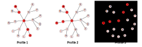

# nJSD

nJSD is a python package for calculating distance between two biological networks instantiated with gene-expression profiles using entropy concept. It was designed to measure intratumor heterogeneity from bulk RNA-sequencing data. **Transcriptome-based ITH (tITH)** of tumor state was calculated by considering both normal state and ideally heterogeneous state.

## Installation

```python
pip install njsd
```

## Usage

nJSD supports command-line invocation as below:

```shell
usage: njsd [-h] -n NETWORK -r REF -q QUERY -o OUTPUT [-t GENESET]

Calculate network-based Jensen-Shannon Divergence.

optional arguments:
  -h, --help            show this help message and exit
  -n NETWORK, --network NETWORK
                        Pre-defined network
  -r REF, --ref REF     Reference gene expression profile
  -q QUERY, --query QUERY
                        Query gene expression profile
  -o OUTPUT, --output OUTPUT
                        Output file.
  -t GENESET, --geneset GENESET
                        Gene set list
```

Note that `-t GENESET` option is optional. If `-t` option is specified, *gene set-specified* nJSD and tITH will be computed. Otherwise, `njsd` will compute *transcriptome-wide* nJSD of the two expression profiles and tITH of query gene expression profile.

**Network file**, which should be given with `-n/--network` option must be formatted as below where each line specifies an edge in the network. `njsd` will simply ignore the header by skipping a single line, so you may name each column in a human-friendly way:

    GeneA GeneB               # Header
    GeneSymbol1 GeneSymbol2
    GeneSymbol1 GeneSymbol3
    GeneSymbol1 GeneSymbol4
    ...

**Gene expression profile**, which should be given with `-r/--ref` or `-q/--query` option must follow the format below. Again, the header doesn't matter. Note that `njsd` will automatically apply log2-transformation to expression values by taking log2(expression + 1), we recommend giving `njsd` unnormalized expression values, such as raw FPKM, RPKM or TPM.

    GeneSymbol  ExpressionValue       # Header
    GeneA 10
    GeneB 20
    BeneC 30
    ...

**Gene set list**, which should be given with `-t/--geneset` option file must have the format below. Please be warned that this file should **not** have a header. The first column denotes names of each gene set(or group), and the following columns represent the members of each group.

    Group1Name  GeneA   GeneB   GeneC   ...
    Group2Name  GeneD   GeneE   GeneF   ...
    Group3Name  GeneA   GeneG   GeneH   ...
    ...

## Examples

Toy data, which represents three different gene expression profiles(`Toy.profile1, Toy.profile2, Toy.profile3`) which are instantiation of the template network(`Toy.network`), are given in `example` directory. Following execution scenarios show how to compute nJSD between the gene expression profiles.

The template network is shown:


And figures below are three gene expression profiles instantiated on top of the template network:



### Transcriptome-wide nJSD

You can compute transcriptome-wide nJSD as below:

```shell
$ njsd -n example/Toy.network -r example/Toy.profile1 -q example/Toy.profile2 -o profile2_njsd_all.txt
```

Output file contains nJSD_NT(Normal-to-Tumor nJSD), nJSD_TA(Tumor-to-maximally Ambiguous state), and tITH values. You can think of *Normal* as *Reference*, and *Tumor* as *Query* gene expression profiles.

```shell
$ cat profile2_njsd_all.txt
```

```shell
nJSD_NT nJSD_TA tITH
0.003935020793376432 0.0068202519228746615 0.36586899255754446
```

Let's compare nJSDs between profile 1 and 2, and profile 1 and 3. 

```shell
$ njsd -n example/Toy.network -r example/Toy.profile1 -q example/Toy.profile3 -o profile3_njsd_all.txt
```

```shell
$ cut -f1 profile2_njsd_all.txt profile3_njsd_all.txt
```

```shell
nJSD_NT
0.003935020793376432
nJSD_NT
0.007758064133920005
```

Indeed, the distance between profile1 and 3 is greater than that of profile 1 and 2.

### Gene set-specified nJSD

You can compute gene set-specified nJSD by specifying `-t/--geneset` option as below:

```shell
$ njsd -n example/Toy.network -r example/Toy.profile1 -q example/Toy.profile2 -t example/Toy.geneset -o output_njsd_gene_set.txt
```

Each line of the output file contains nJSD_NT, nJSD_TA, tITH values for each gene set.

```shell
$ cat output_njsd_gene_set.txt
```

```shell
Gene_set_ID     nJSD_NT nJSD_TA tITH
1st_pwy 0.00782194587529338     0.00938496594270829     0.45458162150340947
2nd_pwy 0.0     0.004261233542045538    0.0
3rd_pwy 0.00521463058352892     0.00710205590340923     0.4233793390015275
4th_pwy 0.007908518155920452    0.004261233542045538    0.6498504120870645
5th_pwy 0.006257556700234704    0.008522467084091077    0.42337933900152747
```

Citation
----------------------

Y. Park, S. Lim, J. Nam, S. Kim, Measuring intratumor heterogeneity by network entropy using RNA-seq data, Scientific Reports (2016)
